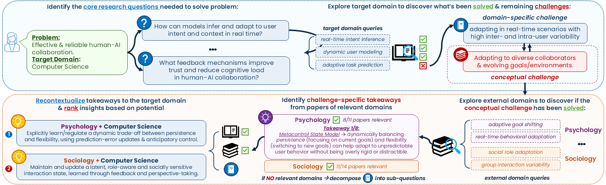

Identify insights from other domains that help address challenges or open up novel opportunities for your research problem:
1. Decomposes a research problem into questions.
2. Searches target-domain literature.
3. Searches cross-domain literature for transferable ideas.
4. Integrates and ranks cross-domain inspirations.

## Quick Start (via `inspiration_pred.py`)

### 1) Install dependencies
```bash
pip install -r requirements.txt
```

### 2) Configure API keys
`search.py` reads Semantic Scholar credentials from `config.py` (`API_KEY`).

### 3) Run the pipeline
Default run (uses `data/cross-domain-inspiration-relations.json`):
```bash
python inspiration_pred.py
```

Useful options:
```bash
python inspiration_pred.py \
  --problem_file data/cross-domain-inspiration-relations.json \
  --model_name Qwen/Qwen3-14B \
  --output_dir inspiration_pred_output \
  --max_papers_per_query 20 \
  --temp 0.7 \
  --min_rel_threshold 0.5 \
  --skip_if_exists
```

### 4) Outputs
Results are written to `inspiration_pred_output/*.json` (or your custom `--output_dir`).
Each output file contains:
- Problem metadata (`research_problem`, `target_domain`, `fine_grained_domain`, `source_groundtruth`)
- Cross-domain evidence grouped by question/domain
- `idea_rankings` (ranked integrated ideas)

### 5) Prepare evaluation inputs from ground-truth abstracts
If you want to convert ground-truth arXiv abstracts into this repo's evaluation format, use:
```bash
python evaluation/process_abstracts.py
```

## Data Format: `data/cross-domain-inspiration-relations.json`

This file is a JSON array. Each entry is one cross-domain inspiration relation used as an input problem. The dataset is derived from: [CHIMERA](https://huggingface.co/datasets/noystl/Recombination-Pred)

Core fields used by `inspiration_pred.py`:
- `source_id` (int): source paper identifier
- `target_id` (int): target paper identifier
- `source_domain` (str): source domain (used as target/focus domain in this pipeline)
- `target_domain` (str): referenced inspired domain
- `source_text` (str): source-side idea phrase
- `target_text` (str): target-side inspiration phrase
- `context` (str): problem statement passed to decomposition
- `publication_year` (int): used to bound literature search
- `abstract` (str): stored as ground truth metadata

Additional metadata fields in the dataset:
- `id`, `relation`, `arxiv_categories`
- `fine_grained_source_domain`, `fine_grained_target_domain`
- `head_leakage`, `tail_leakage`
- `paper_id`

Minimal schema:
```json
[
  {
    "id": "...",
    "source_id": 18243,
    "target_id": 38965,
    "source_domain": "Philosophy",
    "target_domain": "Computer Science",
    "source_text": "...",
    "target_text": "...",
    "relation": "inspiration",
    "publication_year": 2021,
    "paper_id": 2105.00867,
    "abstract": "...",
    "context": "..."
  }
]
```
